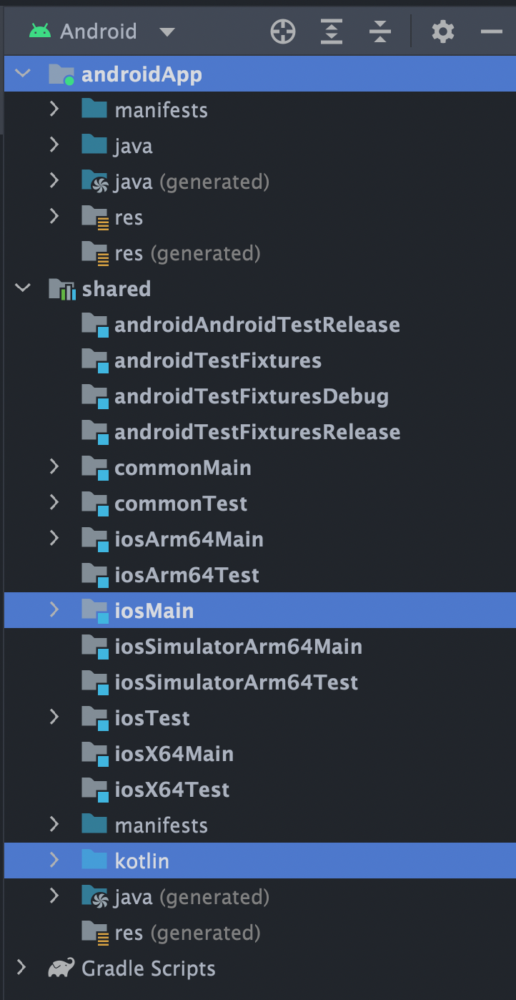

# SpaceX Wiki - iOS & Android apps build on Kotlin Multiplatform Mobile
SpaceX Wiki is iOS and Android applications built using Kotlin Multiplatform Mobile framework which leverages the [SpaceX API](https://github.com/r-spacex/SpaceX-API)

## Please note
Development of the iOS application is ⚠️⚠️⚠️ **currently on pause** ⚠️⚠️⚠️. There is
a [known issue](#Known-issues) that prevents the iOS app from retrieving data from the API or update
the UI state more than once. Anyone willing to support the project may feel free to submit PRs to
help build the iOS application alongside Android. Please refer to the [contributing](#Contributing)
section for more details on how to get involved.

## Known issues

The iOS app is currently returning 404 for all SpaceX API calls, there is
an [issue](https://github.com/prasannajeet/SpaceX_Wiki_KMM_iOS_Android/issues/2) registered for it.
I am not an iOS developer, if anyone can fix this issue with a PR I would highly appreciate it.

## What is Kotlin Multiplatform Mobile
From the [KMM official website](https://kotlinlang.org/lp/mobile/)
> Kotlin Multiplatform Mobile is an SDK for iOS and Android app development. It offers all the combined benefits of creating cross-platform and native apps.

The idea is to create a shared business layer that can then be used by the Android and iOS application in order to build UI on top of it to provide a native UX to the user without having to create two data layer implementations.


[KaMPKit](https://github.com/touchlab/KaMPKit) has created a good read on what is KMM and why you would want to try it out - [WHAT_AND_WHY](https://github.com/touchlab/KaMPKit/blob/main/docs/WHAT_AND_WHY.md)


# Architecture

* [Structure of the Project](#Structure-of-the-Project)
* [Overall Architecture](#Overall-Architecture)
* [Coroutines and Ktor](#Coroutines-and-Ktor)
* [Libraries and Dependencies](#Libraries-and-Dependencies)
  * [Ktor](#Ktor) - Networking
  * [Koin](#Koin) - Dependency Injection

## Structure of the Project

  

As shown above, the **shared** module is the KMM module where the business logic of the application resides. The compiled artifacts from the shared module are imported into the Android and iOS application respectively.

The project structures inside Android Studio and Xcode are as shown below
<p align="center">
  
  
</p>

The project structure is broken up into three different directories: 
* shared
* androidApp
* iosApp

The androidApp directory holds the android version of the app, and all the android code.

Similarly the iosApp directory holds the iOS version of the app, which contains an XCode project and a Workspace. We want to use the workspace as it contains the shared library.

Finally the shared directory holds the shared code. The shared directory is actually an android library that is referenced from the app project. This library contains directories for the different platforms as well as directories for testing.

  * androidMain
  * iosMain
  * commonMain
  * androidTest
  * iosTest
  * commonTest

Each of these directories has the same folder structure: the language type, then the package name.
  i.e. *"app/prasan/spacexwiki/"*

## Overall Architecture

  

## Libraries and Dependencies

If you're familiar with Android projects then you know that the apps dependencies are stored in the build.gradle. Since shared is an android library, it also contains its own build.gradle where it stores its own dependencies. If you open *"shared/build.gradle.kts"* you will see **sourceSets** corresponding to the directories in the shared project. 

Each part of the shared library can declare its own dependencies in these source sets.

Below is some information about some of the libraries used in the project.

* [Ktor](#Ktor)
* [Koin](#Koin)

### Ktor
Documentation: https://ktor.io/

Ktor is a multiplatform networking library for building asynchronous clients. Again since it is a multiplatform library, it  uses code stored in commonMain. Even though all of Ktors code is in **commonMain**, there are some platform specific dependencies needed in the build.gradle. 


### Koin
Documentation: https://insert-koin.io/

Koin is a lightweight dependency injection framework. It is being used in the *koin.kt*, *KoinAndroid.kt* and *KoinIos.kt* files.


## Download & install

First, clone the repository with the 'clone' command, or just download the zip.

```
$ git clone git@github.com:prasannajeet/SpaceX_Wiki_KMM_iOS_Android.git
```

Open the project in Android Studio Chipmunk or higher and the project should compile successfully.
You can open an
new [pull request](https://github.com/prasannajeet/SpaceX_Wiki_KMM_iOS_Android/compare) in case you
face any issues that you fix. Once the project is compiled simply run the Android app and you should
see it run on your device/emulator.

In order to get it working in iOS, simply change the run configuration in Android Studio to iosApp
and run from Android Studio, **you must have Xcode 14+ installed and be on a Mac machine to be able
to build iOS apps. You also need to have homebrew installed and have the homebrew version of
cocoapods & cocoapods-generate installed, the last part is mandatory if you're on an M-chip Mac.**

In order to open the iOS project, go to terminal on your Android Studio and type the following
commands first
```
cd iosApp
```
```
pod install
```

Then open the *iosApp.xcworkspace* file from the finder and build and run the app. [**Note: iOS App not working**](#Please-note)

**Recommended Read** [DETAILED_DEV_SETUP.md](https://github.com/touchlab/KaMPKit/blob/main/docs/DETAILED_DEV_SETUP.md)

## Built with

- [Kotlin Multiplatform Mobile](https://kotlinlang.org/lp/mobile/) 
- [Android Studio Chipmunk](https://developer.android.com/studio/index.html/)
- [Xcode 14](https://developer.apple.com/xcode/)

## Authors

- **Prasan** - Lead Developer: [GitHub](https://github.com/prasannajeet)

## Contributing

As an open source project, pull requests to make this project better are more than welcome, please
read the [contributing guides](CONTRIBUTING.md) first. Then, you can open an
new [issue](https://github.com/prasannajeet/SpaceX_Wiki_KMM_iOS_Android/issues/new/choose) marking
it as a bug or a feature request if you would like the project owner to consider implementing the
change, or if you want to suggest one, open
a [pull request](https://github.com/prasannajeet/SpaceX_Wiki_KMM_iOS_Android/compare).

## License

This project is licensed under the MIT License - see the [LICENSE](LICENSE) file for details.
